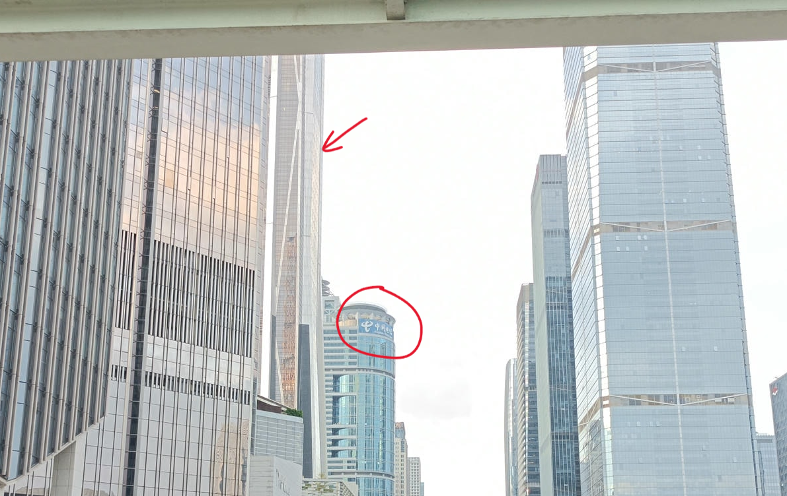

# CityHunt2024 复盘

## 一. 地铁时间

| 起点站 | 终点站 | 出发时间 | 到达时间 | 票价 | 备注 |
|:---:|:---:|:---:|:---:|:---:|:---:|
| 塘朗站 | 红山站 | 09:50 | 10:05 | 3元 |   |
| 红山站 | 龙华站 | 10:30 | 10:43 | 3元 |   |
| 龙华站 | 少年宫站 | 11:45 | 12:10 | 5元 |   |
| 购物公园站 | 南头古城站 | 14:57 | 15:30 | 5元 |   |
| 南头古城站 | 国展站 | 16:08 | 17:10 | 7元 |   |
| 国展站 | 塘朗站 | 17:23 | 18:30 | 8元 | (返程) |

## 二. 整体规划

出发时即选定从龙华区开始打卡，由4号线进入福田中心区，换乘3号线前往罗湖区，随后返回福田进行打卡，最后向南山(南头古城)或者机场沿线地铁进发。

本规划主要考虑到总体地铁分布，以及各区域的打卡点分布，尽量减少地铁换乘次数，提高效率。尤其是南山、宝安区打卡点较少，且分布较为分散，所以将其放在最后打卡。同时考虑到福田区由于点位众多，难以确保打卡的连续性拿到优先打卡的奖励分数，所以将其置于比较后的位置。

但在从龙华区进入福田区的过程中，坐地铁到少年宫站准备换乘3号线时，我们考虑到洪湖公园和东门老街的打卡点出现了变化，并且已经有至少5个组在那个区域，相反福田中心被打的点比较少，所以临时拍脑袋决定从本站出站，速通莲花山后前往书城旁边吃午饭。

随后在福田中心区打着打着我们就到了购物公园地铁站（具体细节见后文），这时候综合考虑时间和剩下的点得分情况，我们决定先前往南头古城然后去机场沿线完成任务。

打完南头古城的点后，其实我们仍然有较为大量时间，但考虑到机场附近还有不少奖励分数，所以决定直奔机场。

## 三. 区域内规划

### 1. 龙华区：深圳美术馆（1）、壹方天地（2）

首先，可以发现这两个区域都位于地铁沿线，先去哪个就成为了需要考虑的问题。我们考虑到深圳美术馆10:00刚刚开门，小红书说周末可能需要排队，所以优先前往深圳美术馆（不知道是英雄所见略同还是为什么大家好像先来了美术馆），之后再前往壹方天地。

五号线前往深圳北站后，4号线6号线都可以前往红山站，但只有1站距离，区别应该不大，具体孰优孰劣有待考证。

在前往美术馆的地铁上，我们已经开始查询美术馆的各个展，并根据所给示例图尝试确定具体打卡点楼层位置。

- 友情提醒：在展览馆内还是尽量不要奔跑，保持安静。

随后地铁前往壹方天地，同样提前通过图片里的细节，先大体锁定商店处在ABCDE哪个区，具体几楼。

1. 首先纵观整个壹方天地，abcde五个区域由近至远依次排布，并且b区，d区为街区形式，a区，c区，e区为商场形式。e区为山姆商店，可以暂时排除

2. 观察所有打卡点图片，可以发现“我爱南科大”（西西弗书店）“镜像人生”打卡点明显在室外，需要重点关注a区，c区的室外和b区，d区。西西弗书店通过搜索可以发现在a区，而仔细观察“镜像人生”图片发现有`壹方天地D区`的字样，所以可以确定“镜像人生”在D区。所以初步确定，a区从外部经过，随后从商场内穿行至D区，优先把两个外场打卡点打掉。

    

3. 所以首先前往西西弗书店，随后我们在穿行c区的过程中顺便发现了popmart，完成“爱乐”打卡点“人体吉他”的打卡。但我们同时发现popmart与图中细节有些不一样，通过询问店员得知popmart负一层店面在装修，挪动到一楼的摊位来了，完成了点位确定。之后前往d区在d区尽头找到了“镜像人生”打卡点。

4. 随后，回头结合网上搜索到的店面位置对打卡点进行细致清理。有几个好玩的细节：
    - “抓娃娃”：壹方天地有很多家娃娃机，但我们通过图片上的电玩城店名找到了店铺，并通过询问店员得知打卡点在二楼随后找到
    - “温暖的抱抱”：两位女生通过她们之前来吃饭的经历带我们迅速锁定了这家"GLORIA"衣服店
    - “奥特曼”：组里的“人机小哥”在小红书搜索到了这三个奥特曼并确定在a区
    - 其他点位不一一列举，但都是通过细节锁定

### 2. 福田中心区（5，6，7，8，9号区域）

从拍脑袋决定爬莲花山之后，我发现这是很正确的决定，莲花山最近有花展，人流量巨大，在午饭时间(12:00-12:30)时间登山相对人没那么多，15分钟爬上山（爬的非常非常的迅速，大赞两位女孩子），15分钟下山，随后前往市民中心把“点赞”完成后，去书城旁边吃饭。

但令在我们意料范围之外的是，书城旁边的餐厅都在排队，所以我们留了我们的“人机小哥”在餐厅等待，剩下三人前往书城寻找打卡点并完成非四人的打卡点。

（由于中心公园离市民中心略远并且点位稀疏，我们果断放弃。）

随后经过午饭和短暂的休息后，我们完成了书城的所有任务，并准备前往城市规划展览馆。这时出现了意料之外的第二件事，此展览馆也需要排队至少20分钟才能进入，所以我们果断放弃这里，并开始寻找“拥抱深圳”任务的位置。

但可能这时候大家都有点小困，加上刚刚打乱计划，我们就着“拥抱深圳”图中的`中国电信`大楼和被遮住一半的`平安金融中心`进行寻找。步行穿过了市民中心，并由福田高铁站的站厅前往平安金融大厦。后来发现本段路程可以由一段地铁代替[哭哭哭哭]

ps: 蓝色为我们的步行路线，黑色为地铁路线，我的错让队友们多走2000步

在此打卡点旁边，我们经过了星河cocopark，大家商量了一下决定重新提起精神前往星河cocopark，完成“星河cocopark”打卡点。

这里大家搜索的技能似乎达到了顶峰，快速确定了除了“天天开心”之外的点位，而最后一个也通过询问保安找到了。

### 3. 南头古城

依然提前依靠搜索把所有点点位确定，然后通过地图快速前往并完成打卡。

ps:本图图标是活动时就标上的

### 4. 机场沿线

继续发扬我们的搜索技能，在地铁上就通过小红书、百度等等软件确定了除了“神经中枢”之外每个点在哪个地铁站。

| 位置 | 打卡点 |
|:---:|:---:|
| 20号线会展城站厅 | 美人鱼 |
| 20号线国展站厅 | 跳动字符|
| 11号线机场北站厅 | 为你倾倒 |
| 20号线机场北站厅 | 魔法波纹 |
| 20号线国展C1口外 | 向光而行 |

但在机场北站由于本人偶遇来看珠海航展在深圳转机的高中同学有点过于激动，差点漏掉了“为你倾倒”打卡点，幸好队友及时提醒，再次谢罪。

- 一起看飞机：

  

最后通过排除法在11号线机场站找到了“神经中枢”打卡点，提前20分钟打卡下班

## 最终成绩

